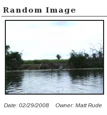

# Gallery2 Image Block

This plugin will allow you to put one of the meny [Gallery2][1] Image Blocks on your [WordPress][2] site. You are required to have a running Gallery2 install to use this plugin.

This is a complete rewrite of [Chris Schierer (aka Lentil)][3], [Gallery2 Image Block Plugin 0.1.4][4]. This rewrite uses the new WordPress 2.8 Widget API, so is only compatable with wordpress 2.8+.

All options described in the [Gallery 2 Image Block documentation][5] are included. User configuration of Image Block options are available in the Widget configuration panel. Blank (empty) options use the Gallery2 defaults.

As of version 0.5, wp-gallery2-image-block has full localization support, and ships with 5 languages besides English. Please contact me if you would like to translate it into more langages, I would love for as meny peaple as posible to be able to use this plugin.

Fully Translated into:

*   Dutch (0.5.1)
*   French
*   English
*   German
*   Italian (0.6.1)
*   Polish (0.6.1)
*   Portuguese (0.5.1)
*   Spanish

**Note:** This widget was written using wp_http to increase compatibility with more sites (version 0.6).
 

  
 
## Download

*   [Gallery2 Image Block . Version 0.6.3][6]
*   [Gallery2 Image Block . Version 0.6.2][7]
*   [Gallery2 Image Block . Version 0.6.1][8]
*   [Gallery2 Image Block . Version 0.6][9]
*   [Gallery2 Image Block . Version 0.5.2][10]
*   [Gallery2 Image Block . Version 0.5.1][11]
*   [Gallery2 Image Block . Version 0.5][12]
*   [Gallery2 Image Block . Version 0.4][13]
*   [Gallery2 Image Block . Version 0.3][14]
*   [Gallery2 Image Block . Version 0.1][15]

You can also clone the project with [Git][16] by running: 
<pre>$ git clone git://github.com/mattrude/wp-gallery2-image-block</pre> If your using git, make sure to hit the 

[Gallery2 Image Block's github page][17]. 

  
 
## Screen Shots

   

  
 
## Dependencies

[WordPress][2] 2.8+

[Gallery2][1] Dose not work with version 3

  
 
## Installing

Extract the zip file and copy the folder **"random-image-block"** into the **"wp-content/plugins/"** directory in your WordPress installation and then activate the plugin from **Plugins -> Installed page**.

  
 
## Frequently Asked Questions

### Q: Will this plugin work without Gallery2?

*   Sorry No, Gallery2 is required.

### Q: Will I be able to add a random image to a page with this plugin?

*   Sorry, this plugin will only work in the wiget sidebar.

### Q: Recived "SECURITY VIOLATION The action you attempted is not permitted" error on page load

*   make sure the Gallery2 plugin "Image Block" is installed and active on your Gallery2 install. You should be abl TRUNCATED! Please download pandoc if you want to convert large files.

 [1]: http://gallery.menalto.com/
 [2]: http://wordpress.org/
 [3]: http://www.theschierers.net/blog
 [4]: http://wordpress.org/extend/plugins/gallery2-image-block-widget
 [5]: http://codex.gallery2.org/Gallery2:Modules:imageblock
 [6]: http://github.com/mattrude/wp-gallery2-image-block/zipball/0.6.3
 [7]: http://github.com/mattrude/wp-gallery2-image-block/zipball/0.6.2
 [8]: http://github.com/mattrude/wp-gallery2-image-block/zipball/0.6.1
 [9]: http://github.com/mattrude/wp-gallery2-image-block/zipball/0.6
 [10]: http://github.com/mattrude/wp-gallery2-image-block/zipball/0.5.2
 [11]: http://github.com/mattrude/wp-gallery2-image-block/zipball/0.5.1
 [12]: http://github.com/mattrude/wp-gallery2-image-block/zipball/0.5
 [13]: http://github.com/mattrude/wp-gallery2-image-block/zipball/0.4
 [14]: http://github.com/mattrude/wp-gallery2-image-block/zipball/0.3
 [15]: http://github.com/mattrude/wp-gallery2-image-block/zipball/0.1
 [16]: http://git-scm.com
 [17]: http://github.com/mattrude/wp-gallery2-image-block
